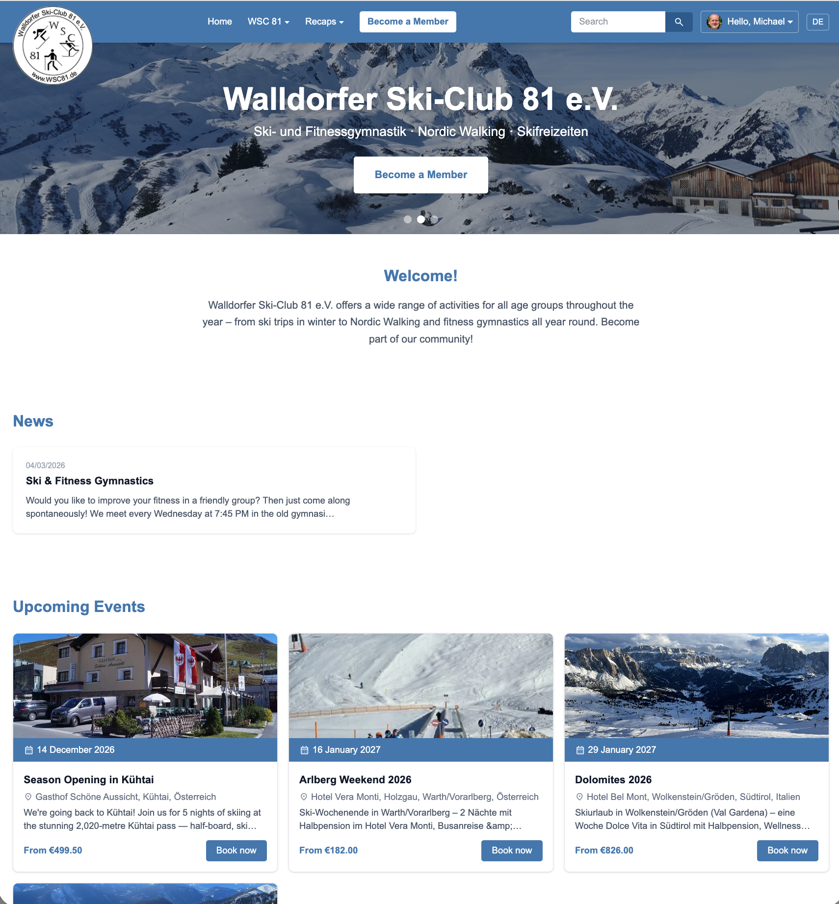
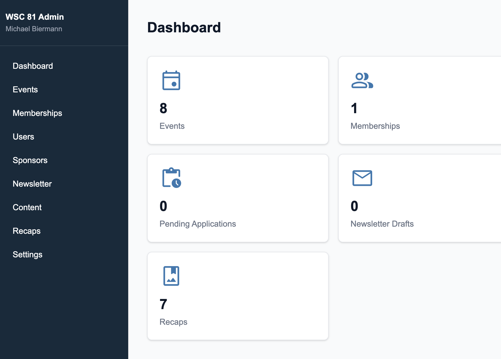

# WSC 81 — Walldorfer Ski-Club 81 e.V.

Homepage for **Walldorfer Ski-Club 81 e.V.**, built with Next.js 16 (App Router), PostgreSQL/Prisma, Tailwind CSS, and next-intl (DE/EN).





## Features

- **Public homepage** — hero slider, events calendar, news, sponsors, contact
- **Event booking** — up to 10 participants, member surcharge waiver, confirmation email
- **Membership application** — up to 10 persons, SEPA bank details, 7-day activation token
- **User accounts** — register, email verification, profile editor, booking history
- **Full-text search** — PostgreSQL tsvector across events, news, recaps and pages
- **Admin area** — manage events, memberships, bookings (PDF export), newsletter, content, sponsors, settings

## Stack

| Layer | Technology |
|---|---|
| Framework | Next.js 16 (App Router) |
| Database | PostgreSQL + Prisma ORM |
| Auth | NextAuth v5 (credentials) |
| Email | Nodemailer / SendGrid |
| i18n | next-intl (DE default, EN) |
| Styling | Tailwind CSS |
| Rich text | TipTap |
| AI | Anthropic Claude API |
| Storage | Vercel Blob |
| Deployment | Vercel |

## Getting Started

```bash
npm install
cp .env.example .env.local   # fill in DATABASE_URL, SMTP_*, etc.
npx prisma migrate dev
npm run db:seed
npm run dev                  # http://localhost:3000
```

Default admin login: `admin@wsc81.de` / `admin123` (change after first login).
